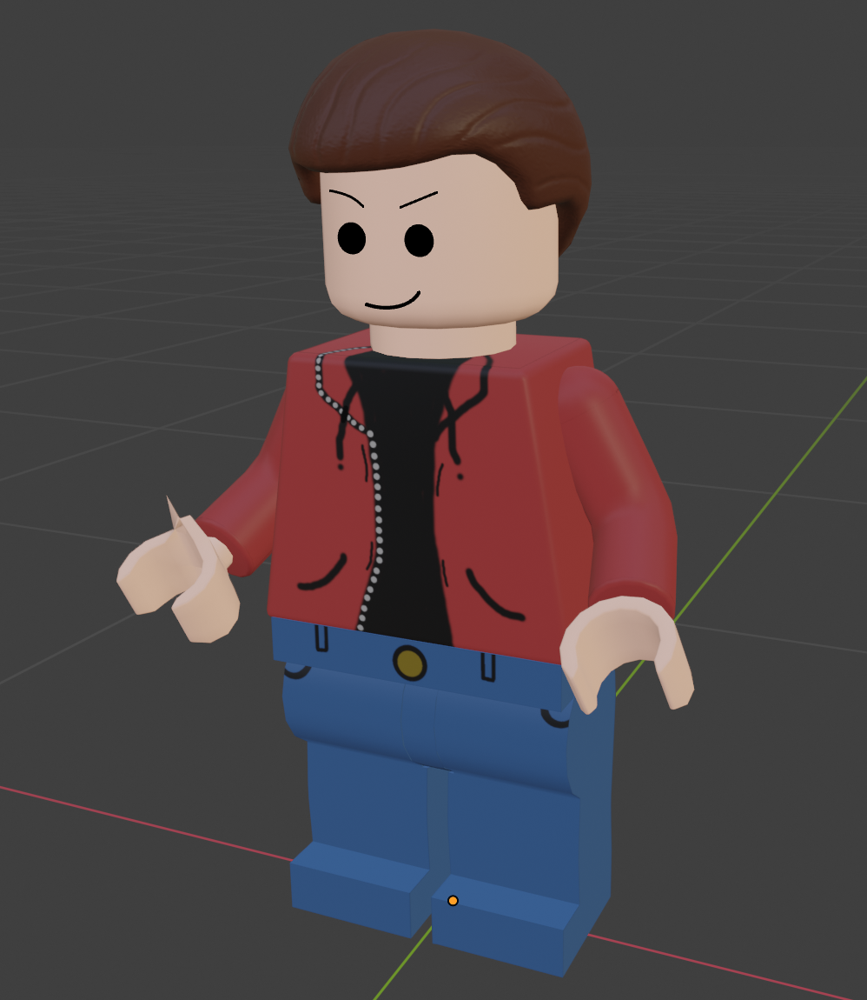

# MyLegoCharacter
Modelled, texture painted, rigged, and animated my own Lego Character in Blender.

A small issue was discovered when animating the charcter. A vertex on one of the wrists was being stretched when moving the character, and it is believed that it was due to how the character was rigged. 

Below is a screenshot of the final model:

Here are the videos of the character animations:
https://www.dropbox.com/s/e19m009hcfsuc2e/LegoCharacterIdleVideo.mp4?dl=0
https://www.dropbox.com/s/e19m009hcfsuc2e/LegoCharacterIdleVideo.mp4?dl=0
